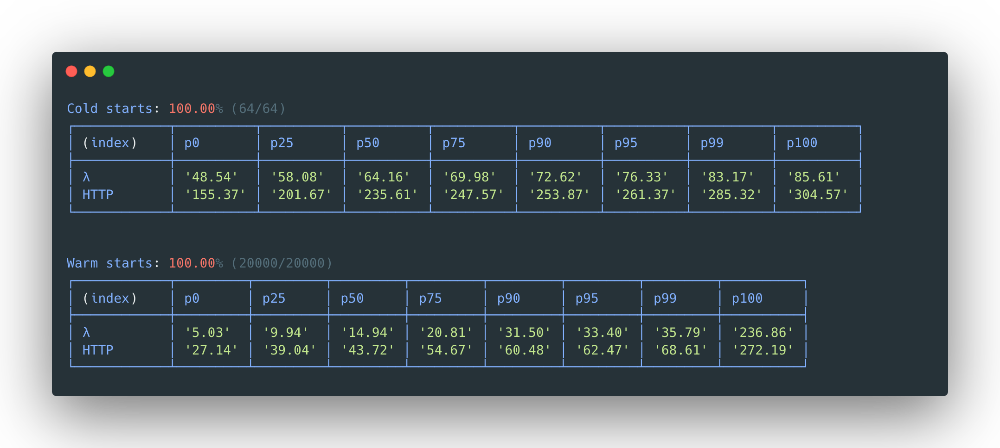
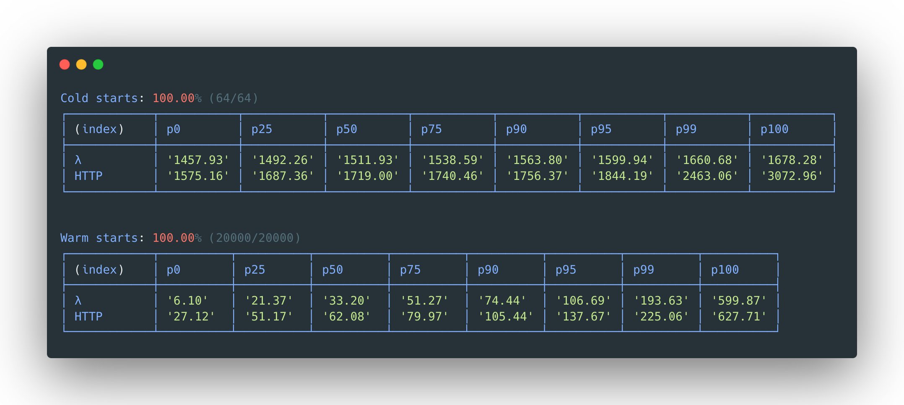

[](https://github.com/awslabs/llrt/actions/workflows/ci.yml) [](https://github.com/awslabs/llrt/actions/workflows/release.yml)

LLRT (**L**ow **L**atency **R**un**t**ime) is a lightweight JavaScript runtime designed to address the growing demand for fast and efficient Serverless applications. LLRT offers up to over **10x** faster startup and up to **2x** overall lower cost compared to other JavaScript runtimes running on **AWS Lambda**

It's built in Rust, utilizing QuickJS as JavaScript engine, ensuring efficient memory usage and swift startup.

> [!WARNING]
> LLRT is an **experimental** package. It is subject to change and intended only for evaluation purposes.

<sub>LLRT - [DynamoDB Put, ARM, 128MB](example/functions/src/v3-lib.mjs):<sub>


<sub>Node.js 20 - [DynamoDB Put, ARM, 128MB](example/functions/src/v3-lib.mjs):<sub>


HTTP benchmarks measured in **round trip time** for a cold start ([why?](#benchmark-methodology))

## Configure Lambda functions to use LLRT

Download the last LLRT release from <https://github.com/awslabs/llrt/releases>

### Option 1: Custom runtime (recommended)

Choose `Custom Runtime on Amazon Linux 2023` and package the LLRT `bootstrap` binary together with your JS code.

### Option 2: Use a layer

Choose `Custom Runtime on Amazon Linux 2023`, upload `llrt-lambda-arm64.zip` or `llrt-lambda-x64.zip` as a layer and add to your function

### Option 3: Package LLRT in a container image

See our [AWS SAM example](./example/llrt-sam-container-image) or:

```dockerfile
FROM --platform=arm64 busybox
WORKDIR /var/task/
COPY app.mjs ./
ADD https://github.com/awslabs/llrt/releases/latest/download/llrt-container-arm64 /usr/bin/llrt
RUN chmod +x /usr/bin/llrt

ENV LAMBDA_HANDLER "app.handler"

CMD [ "llrt" ]
```

### Option 4: AWS SAM

The following [example project](example/llrt-sam/) sets up a lambda
instrumented with a layer containing the llrt runtime.

### Option 5: AWS CDK

You can use [`cdk-lambda-llrt` construct library](https://github.com/tmokmss/cdk-lambda-llrt) to deploy LLRT Lambda functions with AWS CDK.

```ts
import { LlrtFunction } from "cdk-lambda-llrt";

const handler = new LlrtFunction(this, "Handler", {
  entry: "lambda/index.ts",
});
```

See [Construct Hub](https://constructs.dev/packages/cdk-lambda-llrt/) and [its examples](https://github.com/tmokmss/cdk-lambda-llrt/tree/main/example) for more details.

That's it 🎉

> [!IMPORTANT]
> Even though LLRT supports [ES2023](https://262.ecma-international.org/14.0/) it's **NOT** a drop in replacement for Node.js. Consult [Compatibility matrix](#compatibility-matrix) and [API](API.md) for more details.
> All dependencies should be bundled for a `browser` platform and mark included `@aws-sdk` packages as external.

## Testing & ensuring compatibility

The best way to ensure your code is compatible with LLRT is to write tests and execute them using the built-in test runner. The test runner currently supports Jest/Chai assertions. There are three main types of tests you can create:

Unit Tests

- Useful for validating specific modules and functions in isolation
- Allow focused testing of individual components

End-to-End (E2E) Tests

- Validate overall compatibility with AWS SDK and WinterTC compliance
- Test the integration between all components
- Confirm expected behavior from end-user perspective
- For more information about the E2E Tests and how to run them, see [here](tests/e2e/README.md).

Web Platform Tests (WPT)

- Useful for validating LLRT’s behavior against standardized browser APIs and runtime expectations
- Ensure compatibility with web standards and cross-runtime environments
- Help verify alignment with WinterTC and broader JavaScript ecosystem
- For setup instructions and how to run WPT in LLRT, see [here](tests/wpt/README.md).

### Test runner

Test runner uses a lightweight Jest-like API and supports Jest/Chai assertions. For examples on how to implement tests for LLRT see the `/tests` folder of this repository.

To run tests, execute the `llrt test` command. LLRT scans the current directory and sub-directories for files that ends with `*.test.js` or `*.test.mjs`. You can also provide a specific test directory to scan by using the `llrt test -d <directory>` option.

The test runner also has support for filters. Using filters is as simple as adding additional command line arguments, i.e: `llrt test crypto` will only run tests that match the filename containing `crypto`.

## Compatibility matrix

> [!NOTE]
> LLRT only support a fraction of the Node.js APIs. It is **NOT** a drop in replacement for Node.js, nor will it ever be. Below is a high level overview of partially supported APIs and modules. For more details consult the [API](API.md) documentation

| [Node.js API](https://nodejs.org/api/index.html) | Node.js | LLRT   |
| ------------------------------------------------ | ------- | ------ |
| node:assert                                      | ✔︎     | ✔︎️⚠️ |
| node:async_hooks                                 | ✔︎     | ✔︎️⚠️ |
| node:buffer                                      | ✔︎     | ✔︎️⚠️ |
| node:child_process                               | ✔︎     | ✔︎⚠️  |
| node:cluster                                     | ✔︎     | ✘      |
| node:console                                     | ✔︎     | ✔︎⚠️  |
| node:crypto                                      | ✔︎     | ✔︎⚠️  |
| node:dgram                                       | ✔︎     | ✘      |
| node:diagnostics_channel                         | ✔︎     | ✘      |
| node:dns                                         | ✔︎     | ✔︎⚠️  |
| node:events                                      | ✔︎     | ✔︎⚠️  |
| node:fs                                          | ✔︎     | ✔︎⚠️  |
| node:fs/promises                                 | ✔︎     | ✔︎⚠️  |
| node:http                                        | ✔︎     | ✘⏱    |
| node:http2                                       | ✔︎     | ✘      |
| node:https                                       | ✔︎     | ✘⏱    |
| node:inspector                                   | ✔︎     | ✘      |
| node:inspector/promises                          | ✔︎     | ✘      |
| node:module                                      | ✔︎     | ✔︎⚠️  |
| node:net                                         | ✔︎     | ✔︎⚠️  |
| node:os                                          | ✔︎     | ✔︎⚠️  |
| node:path                                        | ✔︎     | ✔︎⚠️  |
| node:perf_hooks                                  | ✔︎     | ✔︎⚠️  |
| node:process                                     | ✔︎     | ✔︎⚠️  |
| node:querystring                                 | ✔︎     | ✘      |
| node:readline                                    | ✔︎     | ✘      |
| node:readline/promises                           | ✔︎     | ✘      |
| node:repl                                        | ✔︎     | ✘      |
| node:sqlite                                      | ✔︎     | ✘      |
| node:stream                                      | ✔︎     | ✔︎\*  |
| node:stream/promises                             | ✔︎     | ✔︎\*  |
| node:stream/web                                  | ✔︎     | ✔︎⚠️  |
| node:string_decoder                              | ✔︎     | ✔︎    |
| node:test                                        | ✔︎     | ✘      |
| node:timers                                      | ✔︎     | ✔︎⚠️  |
| node:tls                                         | ✔︎     | ✘⏱    |
| node:tty                                         | ✔︎     | ✔︎⚠️  |
| node:url                                         | ✔︎     | ✔︎⚠️  |
| node:util                                        | ✔︎     | ✔︎⚠️  |
| node:v8                                          | ✔︎     | ✘\*\*  |
| node:vm                                          | ✔︎     | ✘      |
| node:wasi                                        | ✔︎     | ✘      |
| node:worker_threads                              | ✔︎     | ✘      |
| node:zlib                                        | ✔︎     | ✔︎⚠️  |

| [LLRT API](https://github.com/awslabs/llrt/blob/main/API.md) | Node.js | LLRT |
| ------------------------------------------------------------ | ------- | ---- |
| llrt:hex                                                     | ✘       | ✔︎  |
| llrt:qjs                                                     | ✘       | ✔︎  |
| llrt:util                                                    | ✘       | ✔︎  |
| llrt:xml                                                     | ✘       | ✔︎  |

| [Web Platform API](https://min-common-api.proposal.wintertc.org/) | LLRT  |
| ----------------------------------------------------------------- | ----- |
| COMPRESSION                                                       | ✘⏱   |
| CONSOLE                                                           | ✔︎⚠️ |
| DOM                                                               | ✔︎⚠️ |
| ECMASCRIPT                                                        | ✔︎⚠️ |
| ENCODING                                                          | ✔︎⚠️ |
| FETCH                                                             | ✔︎⚠️ |
| FILEAPI                                                           | ✔︎⚠️ |
| HR-TIME                                                           | ✔︎   |
| HTML                                                              | ✔︎⚠️ |
| STREAMS                                                           | ✔︎⚠️ |
| URL                                                               | ✔︎   |
| URLPATTERN                                                        | ✘⏱   |
| WASM-JS-API-2                                                     | ✘     |
| WASM-WEB-API-2                                                    | ✘     |
| WEBCRYPTO                                                         | ✔︎⚠️ |
| WEBIDL                                                            | ✔︎⚠️ |
| XHR                                                               | ✔︎⚠️ |

| Other features | LLRT |
| -------------- | ---- |
| async/await    | ✔︎  |
| esm            | ✔︎  |
| cjs            | ✔︎  |

_⚠️ = partially supported in LLRT_<br />
_⏱ = planned partial support_<br />
_\* = Not native_<br />
_\*\* = The `module.registerHooks()` API allows you to emulate some functionality. See also `example/register-hooks`._<br />

## Using node_modules (dependencies) with LLRT

Since LLRT is meant for performance critical application it's not recommended to deploy `node_modules` without bundling, minification and tree-shaking.

LLRT can work with any bundler of your choice. Below are some configurations for popular bundlers:

> [!WARNING]
> LLRT implements native modules that are largely compatible with the following external packages.
> By implementing the following conversions in the bundler's alias function, your application may be faster, but we recommend that you test thoroughly as they are not fully compatible.

| Node.js         | LLRT     |
| --------------- | -------- |
| fast-xml-parser | llrt:xml |

### ESBuild

```shell
esbuild index.js --platform=browser --target=es2023 --format=esm --bundle --minify --external:@aws-sdk --external:@smithy
```

### Rollup

```javascript
import resolve from "@rollup/plugin-node-resolve";
import commonjs from "@rollup/plugin-commonjs";
import terser from "@rollup/plugin-terser";

export default {
  input: "index.js",
  output: {
    file: "dist/bundle.js",
    format: "esm",
    sourcemap: true,
    target: "es2023",
  },
  plugins: [resolve(), commonjs(), terser()],
  external: ["@aws-sdk", "@smithy"],
};
```

### Webpack

```javascript
import TerserPlugin from "terser-webpack-plugin";
import nodeExternals from "webpack-node-externals";

export default {
  entry: "./index.js",
  output: {
    path: "dist",
    filename: "bundle.js",
    libraryTarget: "module",
  },
  target: "web",
  mode: "production",
  resolve: {
    extensions: [".js"],
  },
  externals: [nodeExternals(), "@aws-sdk", "@smithy"],
  optimization: {
    minimize: true,
    minimizer: [
      new TerserPlugin({
        terserOptions: {
          ecma: 2023,
        },
      }),
    ],
  },
};
```

## Using AWS SDK (v3) with LLRT

LLRT includes many AWS SDK clients and utils as part of the runtime, built into the executable. These SDK Clients have been specifically fine-tuned to offer best performance while not compromising on compatibility. LLRT replaces some JavaScript dependencies used by the AWS SDK by native ones such as Hash calculations and XML parsing.
V3 SDK packages not included in the list below have to be bundled with your source code. For an example on how to use a non-included SDK, see [this example build script (buildExternalSdkFunction)](example/functions/build.mjs)

LLRT supports the following three bundles by default. Bundle types and suffixes are as follows.

| Bundle Type | Suffix      | Purpose of Use                                            |
| ----------- | ----------- | --------------------------------------------------------- |
| no-sdk      | \*-no-sdk   | Suitable for workloads that do not use `@aws-sdk`.        |
| std-sdk     | (none)      | Suitable for workloads that utilize the major `@aws-sdk`. |
| full-sdk    | \*-full-sdk | Suitable for workloads that utilize any `@aws-sdk`.       |

The relationship between the supported packages for each bundle type is as follows.

| Analytics                            | no-sdk | std-sdk | full-sdk |
| ------------------------------------ | ------ | ------- | -------- |
| @aws-sdk/client-athena               |        |         | ✔︎      |
| @aws-sdk/client-firehose             |        |         | ✔︎      |
| @aws-sdk/client-glue                 |        |         | ✔︎      |
| @aws-sdk/client-kinesis              |        |         | ✔︎      |
| @aws-sdk/client-opensearch           |        |         | ✔︎      |
| @aws-sdk/client-opensearchserverless |        |         | ✔︎      |

| Application integration     | no-sdk | std-sdk | full-sdk |
| --------------------------- | ------ | ------- | -------- |
| @aws-sdk/client-eventbridge |        | ✔︎     | ✔︎      |
| @aws-sdk/client-scheduler   |        |         | ✔︎      |
| @aws-sdk/client-sfn         |        | ✔︎     | ✔︎      |
| @aws-sdk/client-sns         |        | ✔︎     | ✔︎      |
| @aws-sdk/client-sqs         |        | ✔︎     | ✔︎      |

| Business applications | no-sdk | std-sdk | full-sdk |
| --------------------- | ------ | ------- | -------- |
| @aws-sdk/client-ses   |        | ✔︎     | ✔︎      |
| @aws-sdk/client-sesv2 |        |         | ✔︎      |

| Compute services             | no-sdk | std-sdk | full-sdk |
| ---------------------------- | ------ | ------- | -------- |
| @aws-sdk/client-auto-scaling |        |         | ✔︎      |
| @aws-sdk/client-batch        |        |         | ✔︎      |
| @aws-sdk/client-ec2          |        |         | ✔︎      |
| @aws-sdk/client-lambda       |        |         | ✔︎      |

| Containers                       | no-sdk | std-sdk | full-sdk |
| -------------------------------- | ------ | ------- | -------- |
| @aws-sdk/client-ecr              |        |         | ✔︎      |
| @aws-sdk/client-ecs              |        |         | ✔︎      |
| @aws-sdk/client-eks              |        |         | ✔︎      |
| @aws-sdk/client-servicediscovery |        |         | ✔︎      |

| Databases                        | no-sdk | std-sdk | full-sdk |
| -------------------------------- | ------ | ------- | -------- |
| @aws-sdk/client-dynamodb         |        | ✔︎     | ✔︎      |
| @aws-sdk/client-dynamodb-streams |        |         | ✔︎      |
| @aws-sdk/client-elasticache      |        |         | ✔︎      |
| @aws-sdk/client-rds              |        |         | ✔︎      |
| @aws-sdk/client-rds-data         |        |         | ✔︎      |

| Developer tools      | no-sdk | std-sdk | full-sdk |
| -------------------- | ------ | ------- | -------- |
| @aws-sdk/client-xray |        | ✔︎     | ✔︎      |

| Front-end web and mobile services | no-sdk | std-sdk | full-sdk |
| --------------------------------- | ------ | ------- | -------- |
| @aws-sdk/client-amplify           |        |         | ✔︎      |
| @aws-sdk/client-appsync           |        |         | ✔︎      |
| @aws-sdk/client-location          |        |         | ✔︎      |

| Machine Learning (ML) and Artificial Intelligence (AI) | no-sdk | std-sdk | full-sdk |
| ------------------------------------------------------ | ------ | ------- | -------- |
| @aws-sdk/client-bedrock                                |        |         | ✔︎      |
| @aws-sdk/client-bedrock-runtime                        |        |         | ✔︎      |
| @aws-sdk/client-bedrock-agent                          |        |         | ✔︎      |
| @aws-sdk/client-bedrock-agent-runtime                  |        |         | ✔︎      |
| @aws-sdk/client-polly                                  |        |         | ✔︎      |
| @aws-sdk/client-rekognition                            |        |         | ✔︎      |
| @aws-sdk/client-textract                               |        |         | ✔︎      |
| @aws-sdk/client-translate                              |        |         | ✔︎      |

| Management and governance         | no-sdk | std-sdk | full-sdk |
| --------------------------------- | ------ | ------- | -------- |
| @aws-sdk/client-appconfig         |        |         | ✔︎      |
| @aws-sdk/client-appconfigdata     |        |         | ✔︎      |
| @aws-sdk/client-cloudformation    |        |         | ✔︎      |
| @aws-sdk/client-cloudwatch        |        |         | ✔︎      |
| @aws-sdk/client-cloudwatch-events |        | ✔︎     | ✔︎      |
| @aws-sdk/client-cloudwatch-logs   |        | ✔︎     | ✔︎      |
| @aws-sdk/client-service-catalog   |        |         | ✔︎      |
| @aws-sdk/client-ssm               |        | ✔︎     | ✔︎      |

| Media                        | no-sdk | std-sdk | full-sdk |
| ---------------------------- | ------ | ------- | -------- |
| @aws-sdk/client-mediaconvert |        |         | ✔︎      |

| Networking and content delivery           | no-sdk | std-sdk | full-sdk |
| ----------------------------------------- | ------ | ------- | -------- |
| @aws-sdk/client-api-gateway               |        |         | ✔︎      |
| @aws-sdk/client-apigatewayv2              |        |         | ✔︎      |
| @aws-sdk/client-elastic-load-balancing-v2 |        |         | ✔︎      |

| Security, identity, and compliance        | no-sdk | std-sdk | full-sdk |
| ----------------------------------------- | ------ | ------- | -------- |
| @aws-sdk/client-acm                       |        |         | ✔︎      |
| @aws-sdk/client-cognito-identity          |        | ✔︎     | ✔︎      |
| @aws-sdk/client-cognito-identity-provider |        | ✔︎     | ✔︎      |
| @aws-sdk/client-iam                       |        |         | ✔︎      |
| @aws-sdk/client-kms                       |        | ✔︎     | ✔︎      |
| @aws-sdk/client-secrets-manager           |        | ✔︎     | ✔︎      |
| @aws-sdk/client-sso                       |        |         | ✔︎      |
| @aws-sdk/client-sso-admin                 |        |         | ✔︎      |
| @aws-sdk/client-sso-oidc                  |        |         | ✔︎      |
| @aws-sdk/client-sts                       |        | ✔︎     | ✔︎      |
| @aws-sdk/client-verifiedpermissions       |        |         | ✔︎      |

| Storage             | no-sdk | std-sdk | full-sdk |
| ------------------- | ------ | ------- | -------- |
| @aws-sdk/client-efs |        |         | ✔︎      |
| @aws-sdk/client-s3  |        | ✔︎     | ✔︎      |

| Other bundled packages           | no-sdk | std-sdk | full-sdk |
| -------------------------------- | ------ | ------- | -------- |
| @aws-crypto                      |        | ✔︎     | ✔︎      |
| @aws-sdk/credential-providers    |        | ✔︎     | ✔︎      |
| @aws-sdk/lib-dynamodb            |        | ✔︎     | ✔︎      |
| @aws-sdk/lib-storage             |        | ✔︎     | ✔︎      |
| @aws-sdk/s3-presigned-post       |        | ✔︎     | ✔︎      |
| @aws-sdk/s3-request-presigner    |        | ✔︎     | ✔︎      |
| @aws-sdk/util-dynamodb           |        | ✔︎     | ✔︎      |
| @aws-sdk/util-user-agent-browser |        | ✔︎     | ✔︎      |
| @smithy                          |        | ✔︎     | ✔︎      |

> [!IMPORTANT]
> LLRT currently does not support returning streams from SDK responses. Use `response.Body.transformToString();` or `response.Body.transformToByteArray();` as shown below.
>
> ```javascript
> const response = await client.send(command);
> // or 'transformToByteArray()'
> const str = await response.Body.transformToString();
> ```

## Running TypeScript with LLRT

Same principle as dependencies applies when using TypeScript. TypeScript must be bundled and transpiled into ES2023 JavaScript.

> [!NOTE]
> LLRT will not support running TypeScript without transpilation. This is by design for performance reasons. Transpiling requires CPU and memory that adds latency and cost during execution. This can be avoided if done ahead of time during deployment.

## Rationale

What justifies the introduction of another JavaScript runtime in light of existing options such as [Node.js](https://nodejs.org/en), [Bun](https://bun.sh) & [Deno](https://deno.com/)?

Node.js, Bun, and Deno represent highly proficient JavaScript runtimes. However, they are designed with general-purpose applications in mind. These runtimes were not specifically tailored for the demands of a Serverless environment, characterized by short-lived runtime instances. They each depend on a ([Just-In-Time compiler (JIT)](https://en.wikipedia.org/wiki/Just-in-time_compilation) for dynamic code compilation and optimization during execution. While JIT compilation offers substantial long-term performance advantages, it carries a computational and memory overhead.

In contrast, LLRT distinguishes itself by not incorporating a JIT compiler, a strategic decision that yields two significant advantages:

A) JIT compilation is a notably sophisticated technological component, introducing increased system complexity and contributing substantially to the runtime's overall size.

B) Without the JIT overhead, LLRT conserves both CPU and memory resources that can be more efficiently allocated to code execution tasks, thereby reducing application startup times.

## Limitations

There are many cases where LLRT shows notable performance drawbacks compared with JIT-powered runtimes, such as large data processing, Monte Carlo simulations or performing tasks with hundreds of thousands or millions of iterations. LLRT is most effective when applied to smaller Serverless functions dedicated to tasks such as data transformation, real time processing, AWS service integrations, authorization, validation etc. It is designed to complement existing components rather than serve as a comprehensive replacement for everything. Notably, given its supported APIs are based on Node.js specification, transitioning back to alternative solutions requires minimal code adjustments.

## Building from source

1. Clone code and cd to directory

```
git clone git@github.com:awslabs/llrt.git
cd llrt
```

2. Install git submodules

```
git submodule update --init --checkout
```

3. Install rust

```
curl --proto '=https' --tlsv1.2 -sSf https://sh.rustup.rs | bash -s -- -y
source "$HOME/.cargo/env"
```

4. Install dependencies

```
# MacOS
brew install zig make cmake zstd node corepack

# Ubuntu
sudo apt -y install make zstd
sudo snap install zig --classic --beta

# Windows WSL2 (requires systemd to be enabled*)
sudo apt -y install cmake g++ gcc make zip zstd
sudo snap install zig --classic --beta

# Windows WSL2 (If Node.js is not yet installed)
sudo curl -o- https://raw.githubusercontent.com/nvm-sh/nvm/master/install.sh | bash
nvm install --lts
```

_\* See [Microsoft Devblogs](https://devblogs.microsoft.com/commandline/systemd-support-is-now-available-in-wsl/#how-can-you-get-systemd-on-your-machine)_

5. Install Node.js packages

```
corepack enable
yarn
```

6. Install generate libs and setup rust targets & toolchains

```
make stdlib && make libs
```

> [!NOTE]
> If these commands exit with an error that says `can't cd to zstd/lib`,
> you've not cloned this repository recursively. Run `git submodule update --init` to download the submodules and run the commands above again.

7. Build binaries for Lambda (Per bundle type and architecture desired)

```
# for arm64, use
make llrt-lambda-arm64.zip
make llrt-lambda-arm64-no-sdk.zip
make llrt-lambda-arm64-full-sdk.zip
# or for x86-64, use
make llrt-lambda-x64.zip
make llrt-lambda-x64-no-sdk.zip
make llrt-lambda-x64-full-sdk.zip
```

8. Build binaries for Container (Per bundle type and architecture desired)

```
# for arm64, use
make llrt-container-arm64
make llrt-container-arm64-no-sdk
make llrt-container-arm64-full-sdk
# or for x86-64, use
make llrt-container-x64
make llrt-container-x64-no-sdk
make llrt-container-x64-full-sdk
```

9. Optionally build for your local machine (Mac or Linux)

```
make release
make release-no-sdk
make release-full-sdk
```

You should now have a `llrt-lambda-arm64*.zip` or `llrt-lambda-x64*.zip`. You can manually upload this as a Lambda layer or use it via your Infrastructure-as-code pipeline

## Running Lambda emulator

Please note that in order to run the example you will need:

- Valid AWS credentials via a `~/.aws/credentials` or via environment variables.

```bash
export AWS_ACCESS_KEY_ID=XXX
export AWS_SECRET_ACCESS_KEY=YYY
export AWS_REGION=us-east-1
```

- A DynamoDB table (with `id` as the partition key) on `us-east-1`
- The `dynamodb:PutItem` IAM permission on this table. You can use this policy (don't forget to modify <YOUR_ACCOUNT_ID>):

```json
{
  "Version": "2012-10-17",
  "Statement": [
    {
      "Sid": "putItem",
      "Effect": "Allow",
      "Action": "dynamodb:PutItem",
      "Resource": "arn:aws:dynamodb:us-east-1:<YOUR_ACCOUNT_ID>:table/quickjs-table"
    }
  ]
}
```

Start the `lambda-server.js` in a separate terminal

    node lambda-server.js

Then run llrt:

    make run

## Environment Variables

### `LLRT_ASYNC_HOOKS=value`

When using asynchronous hooks, the hooking function inside QuickJS is activated. This is disabled by default as there is concern that it may have a significant impact on performance.

By setting this environment variable to `1`, the asynchronous hook function can be enabled, allowing you to track asynchronous processing using the `async_hooks` module.

### `LLRT_EXTRA_CA_CERTS=file`

Load extra certificate authorities from a PEM encoded file

### `LLRT_GC_THRESHOLD_MB=value`

Set a memory threshold in MB for garbage collection. Default threshold is 20MB

### `LLRT_HTTP_VERSION=value`

Extends the HTTP request version. By default, only HTTP/1.1 is enabled. Specifying '2' will enable HTTP/1.1 and HTTP/2.

### `LLRT_LOG=[target][=][level][,...]`

Filter the log output by target module, level, or both (using `=`). Log levels are case-insensitive and will also enable any higher priority logs.

Log levels in descending priority order:

- `Error`
- `Warn | Warning`
- `Info`
- `Debug`
- `Trace`

Example filters:

- `warn` will enable all warning and error logs
- `llrt_core::vm=trace` will enable all logs in the `llrt_core::vm` module
- `warn,llrt_core::vm=trace` will enable all logs in the `llrt_core::vm` module and all warning and error logs in other modules

### `LLRT_NET_ALLOW="host[ ...]"`

Space-delimited list of hosts or socket paths which should be allowed for network connections. Network connections will be denied for any host or socket path missing from this list. Set an empty list to deny all connections

### `LLRT_NET_DENY="host[ ...]"`

Space-delimited list of hosts or socket paths which should be denied for network connections

### `LLRT_NET_POOL_IDLE_TIMEOUT=value`

Set a timeout in seconds for idle sockets being kept-alive. Default timeout is 15 seconds

### `LLRT_PLATFORM=value`

Used to explicitly specify a preferred platform for the Node.js package resolver. The default is `browser`. If `node` is specified, "node" takes precedence in the search path. If a value other than `browser` or `node` is specified, it will behave as if "browser" was specified.

### `LLRT_REGISTER_HOOKS=file`

If you want to enable a hooking mechanism that is mostly compatible with Node.js's `module.registerHooks()`, specify the js file name in this environment variable.

We provide a concrete example in `example/register-hooks`.

> [!NOTE]
> This environment variable is only effective when running on AWS Lambda.
> When using the LLRT CLI, hook files must be specified using the --import option instead of this environment variable.

### `LLRT_SDK_CONNECTION_WARMUP=1`

Initializes TLS connections in parallel during function init which significantly reduces cold starts due. Enabled by default, can be disabled with value `0` or `false`

### `LLRT_TLS_VERSION=value`

Set the TLS version to be used for network connections. By default only TLS 1.2 is enabled. TLS 1.3 can also be enabled by setting this variable to `1.3`

## Benchmark Methodology

Although Init Duration [reported by Lambda](https://docs.aws.amazon.com/lambda/latest/dg/lambda-runtime-environment.html) is commonly used to understand cold start impact on overall request latency, this metric does not include the time needed to copy code into the Lambda sandbox.

The technical definition of Init Duration ([source](https://docs.aws.amazon.com/lambda/latest/dg/nodejs-logging.html#node-logging-output)):

> For the first request served, the amount of time it took the runtime to load the function and run code outside of the handler method.

Measuring round-trip request duration provides a more complete picture of user facing cold-start latency.

Lambda invocation results (λ-labeled row) report the sum total of Init Duration + Function Duration.

## Security

See [CONTRIBUTING](CONTRIBUTING.md#security-issue-notifications) for more information.

## License

This library is licensed under the Apache-2.0 License. See the [LICENSE](LICENSE) file.
